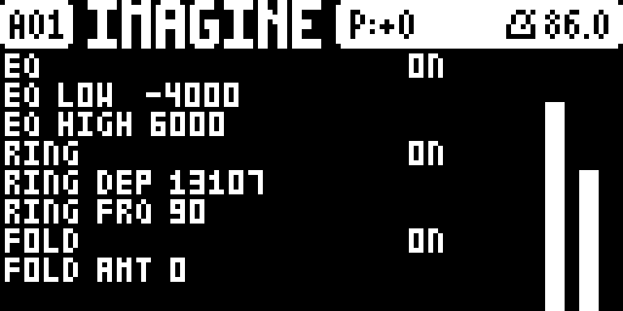

# RingTone

**Master ringmod / wavefolding / EQ for the Digitone mk1.**



Unofficial, community-made [elekloader](https://github.com/irpina/elekloader)
mods for the **Elektron Digitone mk1 / Digitone Keys, OS 1.43**.

## What it is

RingTone is a **set of elekloader mods (`.elemod`) that install together**. They
process the **master mix on the Digitone's main CPU** — the same stage the
firmware runs its own effects on: after the eight FM voices have been mixed and
before that mix is handed to the analog outputs and to the USB stream. So
**every output carries them**. The FM voices themselves run on the Digitone's
**second CPU**, which these mods do not touch; they only process the mixed
audio.

The signal chain is **ring → EQ → fold**, then the output meter:

| mod | stage | what |
|---|---|---|
| `digiring` | **ring** | a sine carrier multiplies the mix — a tremolo at a low rate, a ring at an audio rate |
| `digieq` | **EQ** | a one-pole split with low/high gains (a tone tilt) |
| `digifold` | **fold** | a triangle wavefolder, on/off + amount |
| `digimeter` | **meter** | L/R peak bars, drawn on the DIGI FX page |
| `digictl` | **page** | the DIGI FX master page (FUNC+LFO) that edits the three + the meter |

`digictl` requires the other four, so **install them as a set**: build with
`core-dn1` plus all five mods.

> Unofficial and unsupported. Not affiliated with, endorsed by or supported by
> Elektron. Flashing modified firmware is at your own risk. Read
> [`releases/README.md`](releases/README.md) first.

## Use

The page lives on the master page tree: **FUNC + LFO** cycles the master pages,
and the **fourth entry** is **DIGI FX**. Encoders **A–H** edit EQ on / low /
high, ring on / depth / frequency, fold on / amount; **LEVEL** toggles the meter.
The effects are on by default.

## Layout

```
src/            corea.h, sin256.h  (shared helpers)
mods/<id>/      mod.json + sources + out/<id>-<ver>.elemod
releases/       the packaged .elemods + a README (no firmware)
DSP.md          DSP reference (addresses, the two CPUs, the FM engine, ...)
LICENSE         GPL-2.0
```

## Getting it

elekloader builds a custom OS **on your machine** from your own stock
`Digitone_and_Digitone_Keys_OS1.43.syx` plus these mods; it never distributes
firmware. Take the `.elemod`s from [`releases/`](releases/) (plus
`core-dn1-2.0a.elemod`), add them in elekloader's window, and build the `.syx`.
See [`releases/README.md`](releases/README.md) for install and recovery.

## Building from source

```powershell
$env:PATH = "C:\SysGCC\m68k-elf\bin;" + $env:PATH
$env:ELEKLOADER_CROSS = "m68k-elf-"
$env:PYTHONPATH = "<elekloader checkout>"
$stock = "<your> Digitone_and_Digitone_Keys_OS1.43.syx"
$core  = "core-dn1-2.0a.elemod"
foreach ($m in 'digimeter','digieq','digiring','digifold','digictl') {
  python -m elekloader.sdk.build "mods\$m" --stock $stock
}
python -m elekloader.patch --stock $stock --mod $core `
  --mod mods\digimeter\out\digimeter-1.1.elemod --mod mods\digieq\out\digieq-1.0.elemod `
  --mod mods\digiring\out\digiring-1.0.elemod --mod mods\digifold\out\digifold-1.0.elemod `
  --mod mods\digictl\out\digictl-1.2.elemod --out custom.syx --version 2.0o
```

## Status

Tested in the **digiemu** emulator (boots, settles, `dsp_running=2`; the page
draws as the fourth master entry). **Not yet tested on hardware.** Settings are
**not saved per pattern yet** (they reset at power-off); per-pattern persistence
is the open item.

## Licence

Our own code and docs: **GPL-2.0-or-later** ([LICENSE](LICENSE)). This does not
cover the manufacturer's firmware, which is never distributed here.
